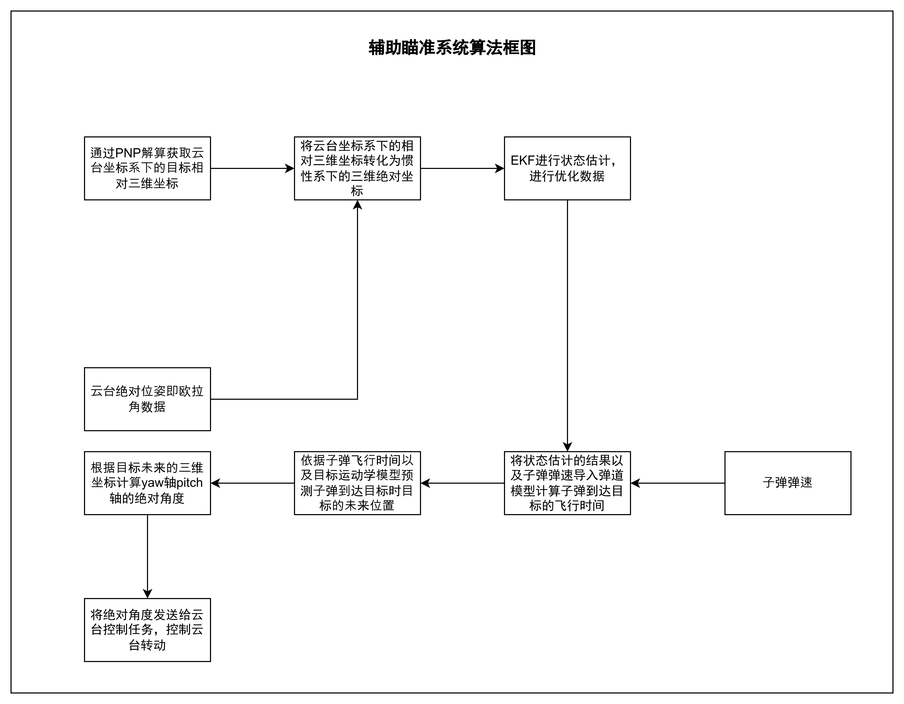

>本文作者为原落尘，邮箱为<yuanluochen@foxmail.com>，笔者能力有限，如有问题，请您指出.

## 一、前言

### 1.1 什么是辅助瞄准系统

首先，请思考一个问题，什么是辅助瞄准系统？

## 二、辅助瞄准系统算法设计

### 2.1 从一个案例说起

思考一下，如果让你设计一个辅助瞄准系统，你该如何设计？辅助瞄准系统说到底就是一个简单的**随动控制系统**(servo control system)，即如下图2.1.1.1所示。获取随动跟随目标的随动目标数值，将随动数值作为控制系统的设定值作用于控制系统，控制系统控制被控对象到达目标数值。

#### 2.1.1 一个追击的例子

就像追击一样，一个人追着另外一个人跑，追击者(或者被控对象)通过眼睛(或者传感器)这种视觉传感器获取被追击者(随动控制目标)的空间相对位置(即以追击者为原点的相对空间坐标)，将该位置作为追击者的控制目标，作用于控制器，控制器(或者说大脑)根据控制目标值输出控制数值作用于追击者，使追着者追击被追击者。

#### 2.1.2 追击例子的分析

回顾上面的例子，我们开始总结一个针对追击例子的系统框图，并分析如何实现一个随动控制系统。

如上图追击控制系统的系统框图如图2.1.2.1所示，整个控制系统需要，追击者眼睛作为**传感器**获取**目标空间位置**，然后我们要将通过传感器获取的**目标空间位置**作为系统**设定值**作用于**控制器**，控制器分析设定值，计算出控制量作用于被控对象，控制被控对象的运动，使追击者到达追击目标。

这就是我们对追击这个案例的一个分析，根据我们对该案例的分析我们可以总结出如果想实现追击目标我们需要一个能检测出追击目标空间位置的**传感器**;一个能分析目标空间位置，并根据空间位置合理计算控制量的一个**控制器**。**传感器获取目标位置，控制器分析目标位置，控制被控对象到达目标位置**

### 2.2 设计最简单的辅助瞄准系统

根据上面追击的案例，我们开始思考如何设计一个最简单的辅助瞄准系统，辅助瞄准系统的核心工作目标为**云台跟随敌方装甲板运动**，就是说，敌方装甲板空间位置在哪里，云台的空间向量就指向哪里。

辅助瞄准的功能该如何实现呢？根据上面追击的例子，实现辅助瞄准，我们最起码需要一个传感器**识别装甲板**，并**获取其空间位置**，也需要一个控制器**分析装甲板的空间位置**，**控制云台**的空间绝对位姿到达装甲板的空间坐标。这一点我们明确了，那么现在问题来了，传感器和控制器该咋搞?在设计一个辅助瞄准系统中我们的传感器要具备识别装甲板的能力，并且具备能获取目标空间位置的能力，控制器要具备能分析空间位置数据，并将数据作用与控制对象的能力。这该咋搞呢?现在我开始分开的讲解一下关于传感器以及控制器的内容

#### 2.2.1 辅助瞄准系统的传感器初识

### 2.3 辅助瞄准系统的算法框图

如上图2.3.1所示，该图为辅助瞄准系统的算法框图，
